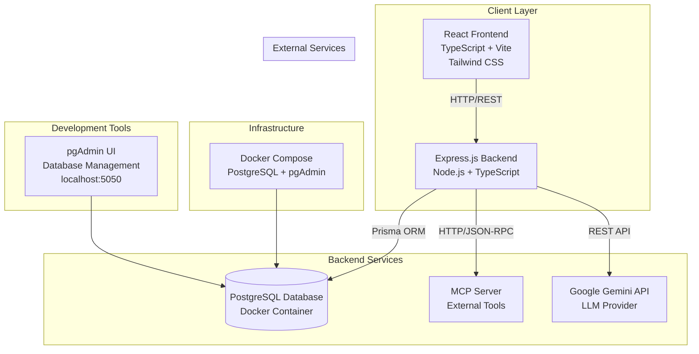
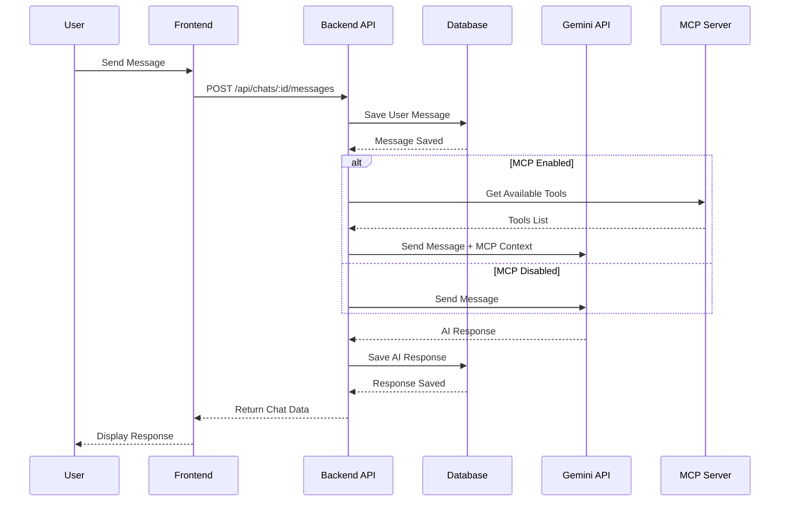
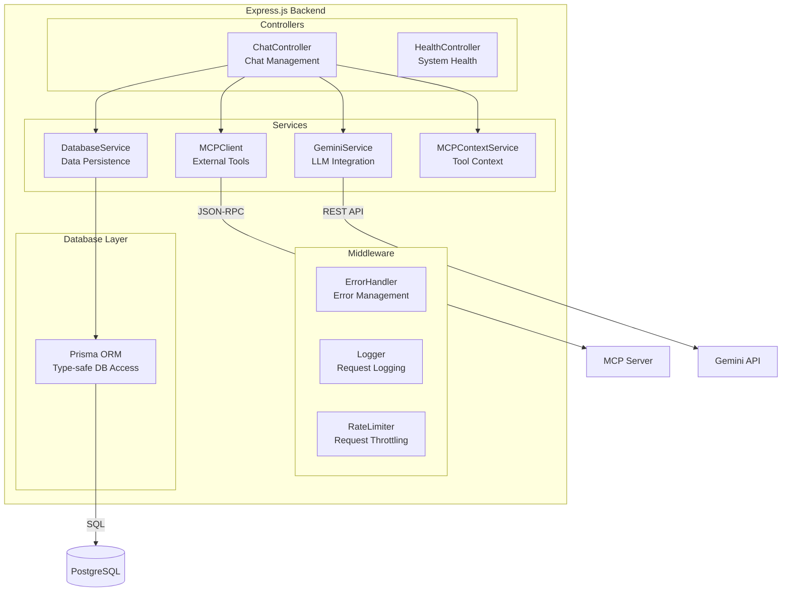
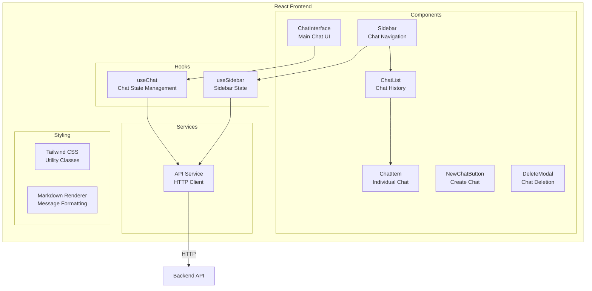
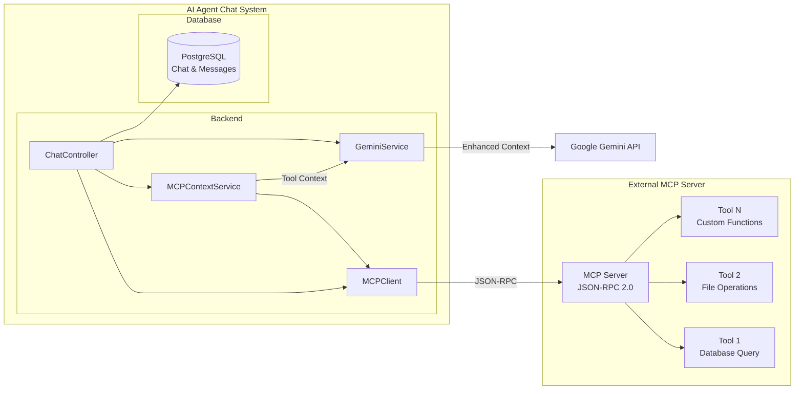
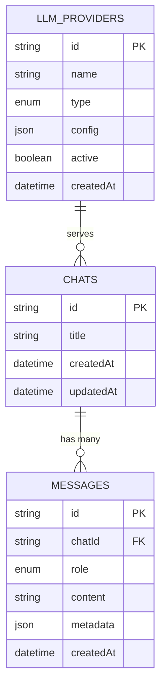
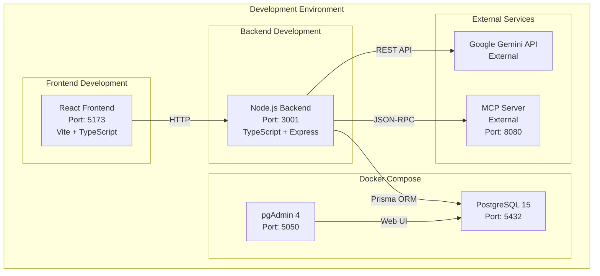
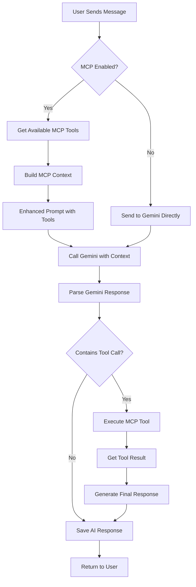

# Architettura del Sistema - AI Agent Chat

Questo documento contiene i diagrammi di architettura del progetto AI Agent Chat, che mostrano la struttura del sistema, i flussi di dati e le integrazioni tra i componenti.

## 📋 Indice

1. [Architettura Generale](#1-architettura-generale)
2. [Flusso Dati Chat](#2-flusso-dati-chat)
3. [Architettura Backend](#3-architettura-backend)
4. [Architettura Frontend](#4-architettura-frontend)
5. [Integrazione MCP](#5-integrazione-mcp)
6. [Schema Database](#6-schema-database)
7. [Deployment](#7-deployment)
8. [Flusso MCP Integration](#8-flusso-mcp-integration)

---

## 1. Architettura Generale

**Descrizione**: Questo diagramma mostra l'architettura generale del sistema, evidenziando i layer principali (Client, Backend, Database) e le loro interazioni con servizi esterni.

---

## 2. Flusso Dati Chat

**Descrizione**: Questo diagramma di sequenza mostra il flusso completo di un messaggio utente, dalla ricezione alla risposta AI, includendo la gestione dell'integrazione MCP.

---

## 3. Architettura Backend

**Descrizione**: Architettura dettagliata del backend, mostrando la separazione tra controllers, services, middleware e database layer.

---

## 4. Architettura Frontend

**Descrizione**: Struttura del frontend React, mostrando i componenti, hooks personalizzati e servizi per la gestione dello stato e delle API.

---

## 5. Integrazione MCP

**Descrizione**: Dettaglio dell'integrazione MCP (Model Context Protocol), mostrando come il sistema si connette a server MCP esterni per estendere le funzionalità AI.

---

## 6. Schema Database

**Descrizione**: Schema del database PostgreSQL, mostrando le tabelle principali e le loro relazioni per la gestione di chat, messaggi e provider LLM.

---

## 7. Deployment

**Descrizione**: Ambiente di sviluppo con Docker Compose, mostrando i servizi locali e le connessioni ai servizi esterni.

---

## 8. Flusso MCP Integration

**Descrizione**: Flusso dettagliato dell'integrazione MCP, mostrando come il sistema decide quando utilizzare i tool MCP e come gestisce le risposte.

---

## 🔧 Tecnologie Utilizzate

### Frontend
- **React 18** - Framework UI
- **TypeScript** - Type safety
- **Vite** - Build tool
- **Tailwind CSS** - Styling
- **React Query** - State management

### Backend
- **Node.js** - Runtime
- **Express.js** - Web framework
- **TypeScript** - Type safety
- **Prisma** - ORM
- **PostgreSQL** - Database

### Integrazioni
- **Google Gemini API** - LLM Provider
- **MCP (Model Context Protocol)** - External Tools
- **Docker Compose** - Development Environment

### Database
- **PostgreSQL 15** - Primary database
- **pgAdmin** - Database management UI

---

## 📚 Documentazione Correlata

- [Specifiche Tecniche](../SPECS.md) - Dettagli tecnici del progetto
- [Processo di Sviluppo](../AGENTS.md) - Workflow di sviluppo
- [Setup e Configurazione](../README.md) - Guida all'installazione
- [Integrazione Gemini](./gemini-integration.md) - Dettagli integrazione Gemini
- [Chat Sidebar](./chat-sidebar.md) - Funzionalità sidebar
- [Supporto Markdown](./markdown-support.md) - Rendering messaggi

---

*Ultimo aggiornamento: Dicembre 2024*
