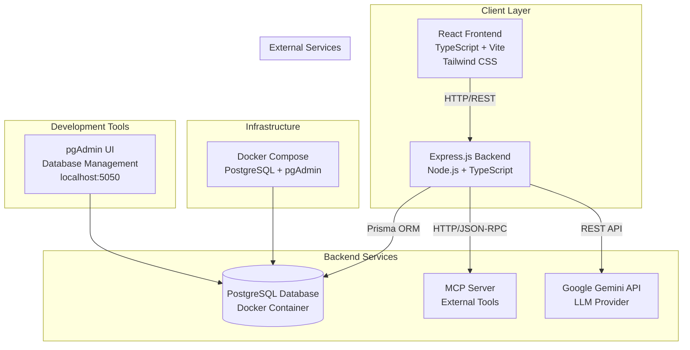
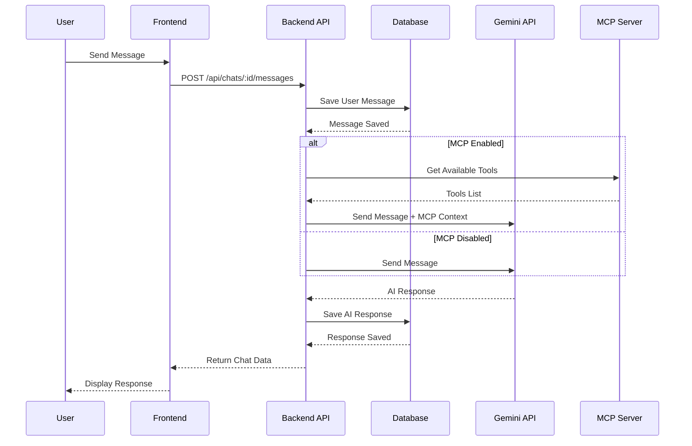
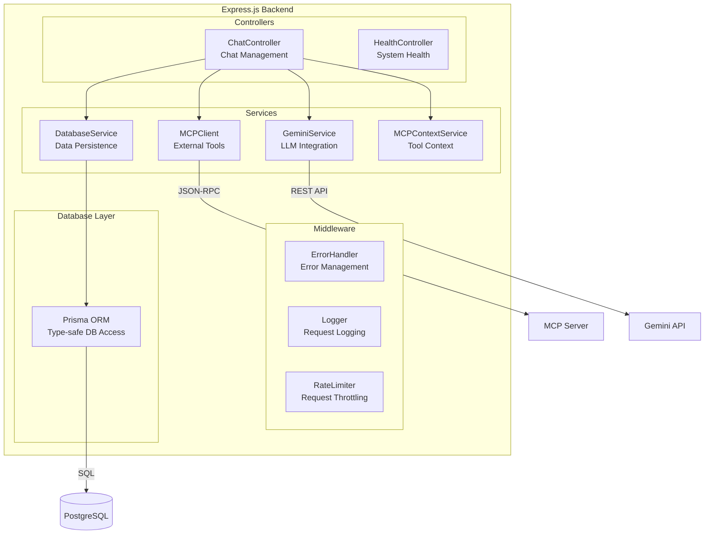
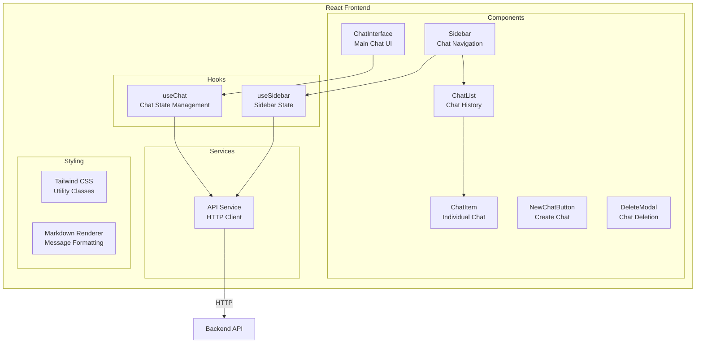
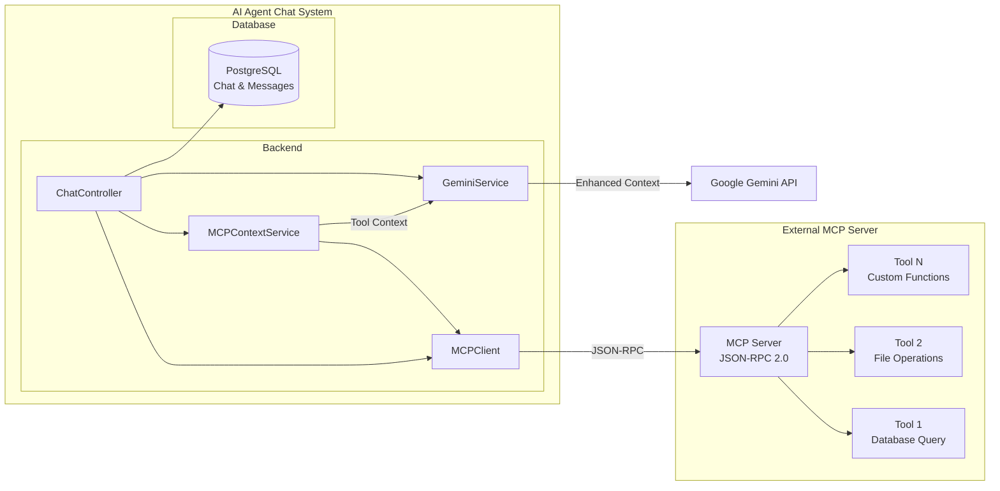
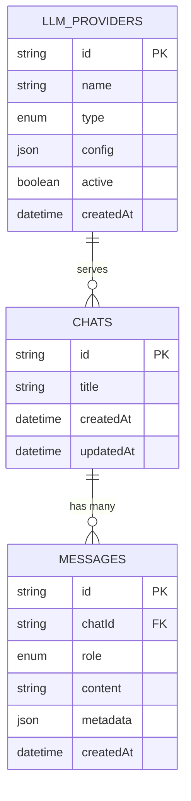
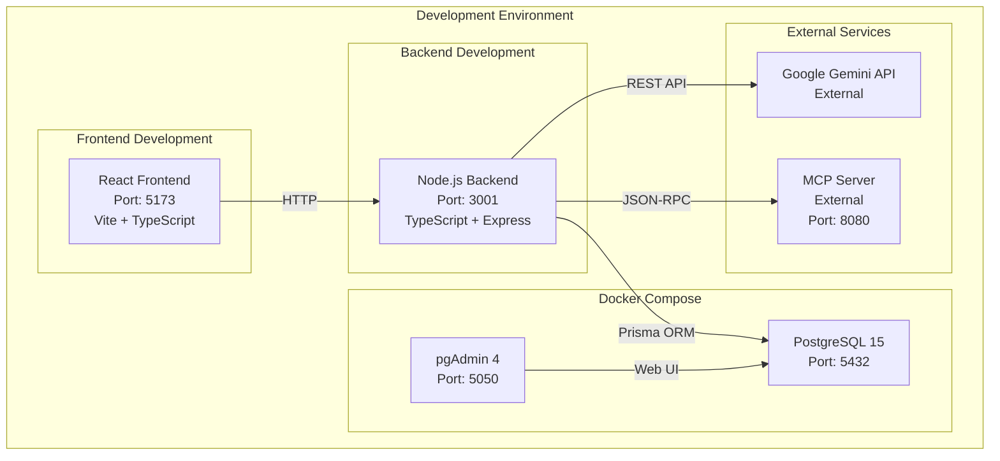
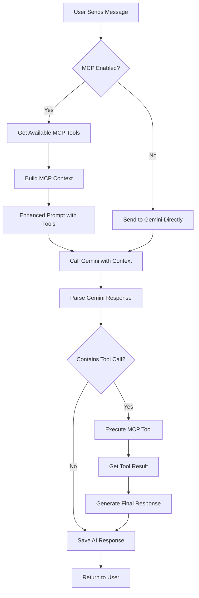
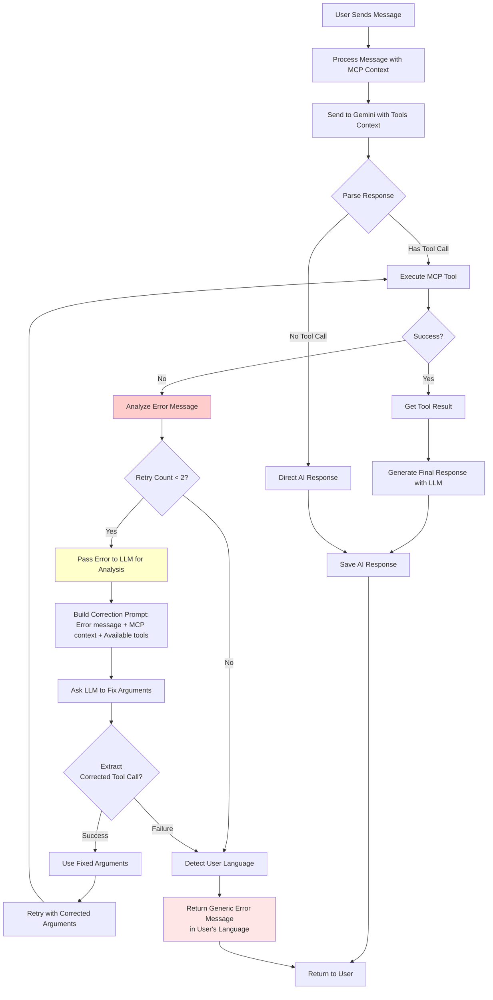

# System Architecture - AI Agent Chat

This document contains the architecture diagrams for the AI Agent Chat project, showing the system structure, data flows, and component integrations.

## 📋 Table of Contents

1. [General Architecture](#1-general-architecture)
2. [Chat Data Flow](#2-chat-data-flow)
3. [Backend Architecture](#3-backend-architecture)
4. [Frontend Architecture](#4-frontend-architecture)
5. [MCP Integration](#5-mcp-integration)
6. [Database Schema](#6-database-schema)
7. [Deployment](#7-deployment)
8. [MCP Integration Flow](#8-mcp-integration-flow)
9. [MCP Error Auto-Correction Flow](#9-mcp-error-auto-correction-flow)

---

## 1. General Architecture

**Description**: This diagram shows the general system architecture, highlighting the main layers (Client, Backend, Database) and their interactions with external services.

---

## 2. Chat Data Flow

**Description**: This sequence diagram shows the complete flow of a user message, from reception to AI response, including MCP integration management.

---

## 3. Backend Architecture

**Description**: Detailed backend architecture, showing the separation between controllers, services, middleware, and database layer.

---

## 4. Frontend Architecture

**Description**: React frontend structure, showing components, custom hooks, and services for state management and API handling.

---

## 5. MCP Integration

**Description**: Detail of MCP (Model Context Protocol) integration, showing how the system connects to external MCP servers to extend AI capabilities.

---

## 6. Database Schema

**Description**: PostgreSQL database schema, showing the main tables and their relationships for managing chats, messages, and LLM providers.

---

## 7. Deployment

**Description**: Development environment with Docker Compose, showing local services and connections to external services.

---

## 8. MCP Integration Flow

**Description**: Detailed MCP integration flow, showing how the system decides when to use MCP tools and how it handles responses.

---

## 9. MCP Error Auto-Correction Flow

**Description**: This diagram shows the intelligent error auto-correction flow when MCP tool calls fail. The system uses the LLM itself to analyze errors and automatically retry with corrected arguments, supporting up to 2 retry attempts before returning a user-friendly error message in the user's detected language.

---

## 📚 Related Documentation

- [Technical Specifications](../SPECS.md) - Project technical details
- [Development Process](../AGENTS.md) - Development workflow
- [Setup and Configuration](../README.md) - Installation guide
- [Gemini Integration](./gemini-integration.md) - Gemini integration details
- [Chat Sidebar](./chat-sidebar.md) - Sidebar functionality
- [Markdown Support](./markdown-support.md) - Message rendering

---

*Last updated: December 2024*
